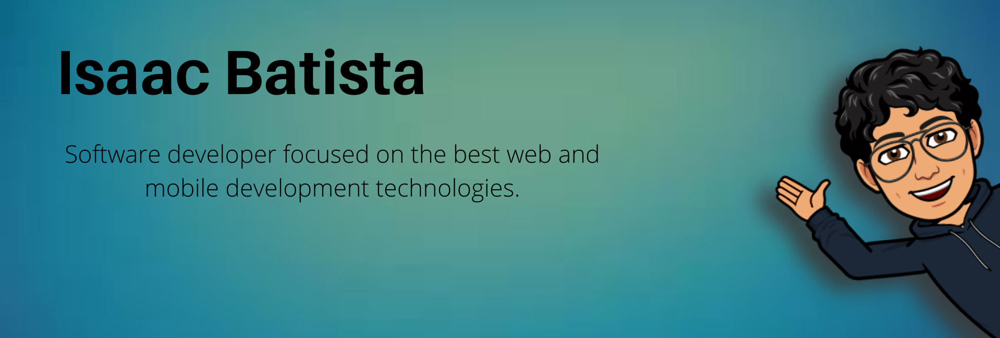

# Hi, I'm Isaac Batista 👋🏼 👨🏻‍💻

 

 

I'm a Full Stack developer passionate about web and mobile technologies. I have experience with projects using Java, Dart, Android and Flutter.

<!-- I'm a Full Stack developer passionate about web and mobile technologies. I have experience with projects using Java, JavaScript, Dart, TypeScript, Python, Android, Flutter, React, React Native and Scode.
Please feel free to clone projects, raise issues and submit PRs if you think something could be better. -->

Please feel free to clone projects, raise issues and submit PRs if you think something could be better.

### Connect with me:

 

### Languages and Tools:

 
 

 
  

    
  

   
   

    
  

